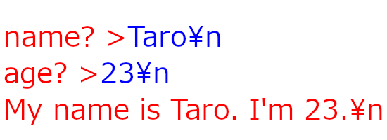

# C言語ソースコードチェッカ
某講義のC言語ソースコードを簡易チェックするためのプログラム

# 機能・仕様
- 1授業回分の提出物をまとめて自動チェック
- 自動コンパイル
  - 基本的にはmsvcでコンパイル
  - GNUライブラリの利用が原因でコンパイルエラーの場合は自動的にgccでコンパイル再試行
- 1問題につきテストケースを最大9個作成可能
- 以下の出力をテストケースと比較可能
  - 標準出力(stdout)
  - 標準エラー出力(stderr)
  - ファイル出力
- コマンドライン引数や標準入力を伴うテストケースも作成可能
- 一定時間以内に終了しないプログラムをタイムアウト
- 再提出された場合は最新の提出物を自動検出して評価
- 結果を見やすいExcelファイルで出力
- ファイル名誤りなど，走査対象外の提出物のファイル名を一覧で出力
- ソースコードは`UTF-8 BOM無`か，`ShiftJIS`で記述（それ以外の場合はEncoding Errorになりチェック非対象）
- テストケースやインクルードさせるコードなどは`UTF-8 BOM無`で記述

# 動作環境
```
Windows 10 / 11
python 3.12.3
openpyxl==3.1.5
Levenshtein == 0.27.3
```

# インストール
1. python 3.12.3をダウンロードしてインストール  
   https://www.python.org/ftp/python/3.12.3/python-3.12.3-amd64.exe

2. 依存関係のインストール
   コマンドプロンプトで以下のコマンドを実行
   ```
   py -3.12 -m pip install openpyxl==3.1.5 Levenshtein==0.27.3
   ```
   `Successfully installed *****`か，`Requirement already satisfied`が返ってくればOK

3. 本プログラムのソースコードをダウンロードして，圧縮ファイルを任意の場所に展開  
   https://github.com/EngYOSHI/CodeChecker/archive/refs/heads/master.zip

4. gccのインストール
   1. Cコンパイラ(mingw-w64)のバイナリをダウンロードする
      `x86_64-xx.x.x-release-win32-seh-ucrt-rt...`をダウンロードする  
      https://github.com/niXman/mingw-builds-binaries/releases/latest

   2. ダウンロードしたCコンパイラの圧縮ファイルを，`％LOCALAPPDATA%\mingw64\`に展開する
      なお7zで圧縮されているので，展開のために7-zipなどのアーカイバが必要な可能性あり  
      このとき，`％LOCALAPPDATA%\mingw64\`フォルダ配下に`bin`, `include`フォルダなどが配置されている状態にすること
   3. PATHを通す

8. Build Tools for Visual Studio 2022をインストール  
   1. インストール  
      https://learn.microsoft.com/ja-jp/visualstudio/releases/2022/release-history#fixed-version-bootstrappers  
      Currentのビルドツールをダウンロードしてインストールする．インストールの際，特に何か変更する必要はない．
   2. x64 Native Tools Command Prompt for VSをスタートメニューから起動してパスを取得
      - PATHに以下の結果を追加
        ```
        C:\Windows\System32\where.exe cl.exe
        ```
      - 以下の結果を，それぞれ環境変数を作成して追加
        ```
        echo %INCLUDE%
        echo %LIB%
        echo %LIBPATH%
        ```
9. `CodeChecker\src\`，`CodeChecker\work\`，`CodeChecker\case\`，`CodeChecker\result\`フォルダを作成する  


# 使い方
1. `CodeChecker\src\`フォルダ内に，1授業回分の提出されたソースコードを入れる  
2. インクルードするヘッダファイルやソースコード，および，実行ファイルに読み込ませるファイルがある場合は，`CodeChecker\work\`フォルダに入れる  
それ以外のファイルは全て削除されていることが望ましい  
3. `CodeChecker\case\`フォルダに，`students.txt`，`tasks.txt`，テストケースをすべて入れる  
テストケースの作り方や注意事項は[該当セクション](#テストケースの作成方法)を参照のこと  
4. `run.cmd`ファイルをダブルクリックで開き，スクリプトを実行する  
5. `CodeChecker\result\`フォルダに，コンパイル済みバイナリや結果のxlsxファイルが出力される  


# テストケースの作成方法
以下のファイルは全て**UTF-8 BOM無**で作成し，`CodeChecker\case\`フォルダに入れる  
テスト結果にNGが多すぎる場合，**テストケースのミスを疑おう**．  
## 学籍番号一覧 (students.txt)
採点対象の学籍番号を1行に一名分入れる  

## 課題番号一覧 (tasks.txt)
チェックする授業回の課題番号と，用意したテストケース数を，1行に1つ入れる  
（ただし，各課題におけるテストケース数の最大は9である）  
例えば課題`1-1a`のテストケース数が1個，`1-1b`のテストケース数が2個の場合，以下のようになる  
```
1-1a 1
1-1b 2
```
- ファイルの出力を評価する場合
  プログラムが出力したファイルの中身を評価したい場合は， `outfile="<filename.txt>"`を指定する．
  ```
  1-1a 1 outfile="<filename.txt>"
  ```
  この状態で，テストケースを`~_fout.txt`というファイル名で用意すれば，そのテストケースは指定されたファイル名のファイルの中身を評価する．  
  ファイル名は1つの課題につき1つしか指定できないが，どの出力を評価するかはテストケースごとに変えられる．
  後述するスキップと併用することも可能である．
- 特定のテストケースの比較をスキップする場合
  出力が一意に定まらない場合（乱数を用いる，メモリ番地を表示するなど），テストケースと比較して評価することが不可能である．  
  その場合は， `skip[1-9]="{stdout | stderr | file}"`を指定すれば，指定した出力を記録した上で，比較評価はスキップできる．  
  ここで，`[1-9]`はテストケース番号，`{stdout | stderr | file}`は記録する出力の種類である．  
  例えば，1番目のテストケースにおいて，標準出力(stdout)を記録するが，比較評価はしない場合は，以下のようになる  
  ```
  1-1a 1 skip1="stdout"
  ```

## コマンドライン引数，標準出力，標準入力
本プログラムでは，プログラムの実行結果を模範解答と比較して一致するか検証できる．  
コマンドライン引数や標準入力を与えたときの出力結果も取得できる．  
この，与えるコマンドライン引数や標準入力と，その出力（実行結果）を1組として考え，1課題につき9個までテストケースを用意できる．  
ただし，コマンドライン引数や標準入力を与えない課題では，出力は1通りしかないため，テストケースは高々1つ用意すれば良い．
ファイル名は`<課題番号>_<テストケース番号>_{arg|out|eout|fout|in}.txt`となる．（ただし，**テストケース番号は1から始まり**，最大値は9である．）  

### コマンドライン引数 (~_arg.txt)
プログラム実行時にコマンドライン引数を与えたい場合に用意する．コマンドライン引数を与えない場合はファイルを用意しない．  
例えば，課題1-1aにおける1個目のテストケースにおけるコマンドライン引数の場合，`1-1a_1_arg.txt`となる．  

中身には，与えたいコマンドライン引数を1行で記述する．複数与える場合はスペースで区切る．  

### 標準出力 (\~_out.txt), 標準エラー出力 (\~_eout.txt), ファイル出力 (\~_fout.txt)
プログラムの出力（実行結果）の模範解答を用意する．  
ここでファイル名は，標準出力の場合は`\~_out.txt`，標準エラー出力の場合は`\~_eout.txt`，ファイル出力の場合は`\~_fout.txt`とする．  
例えば，課題1-1aにおける1個目のテストケースにおける標準出力の場合，`1-1a_1_out.txt`となる．  
ここで，同一テストケースに2つ以上の出力ファイルを用意することはできない．  
もし複数種類存在する場合，ファイル出力(fout) -> 標準エラー出力(eout) -> 標準出力(out)の順番で，先に見つかったものが読み込まれる．  
また，乱数要素がある課題など，出力のテストケースを用意できないときは，[課題番号一覧のセクション](#課題番号一覧-taskstxt)を参考にtasks.txtにskipを記載する．  
スキップすると，出力を結果ファイルに記録だけ行い，比較評価は行わない．  

中身には，期待する出力を記述する．  
ただし，以下の点に注意のこと  
- 出力については，スペースが半角か全角か，インデントがタブ文字かスペースか，末尾の改行文字の有無まで全て区別される．これら一字一句も含めて比較して完全一致した場合，テスト結果が`OK`になる．つまり，出力評価は完全に競プロ仕様である．そのため，プログラムの出力が期待する出力と一致するようにするために，出題時点で仕様を細かく指示するか，テスト結果が`NG`となった場合でも手動でチェックするなどする必要がある．前者の方が圧倒的に楽である．
- 上記のことから，テスト結果が`NG`の場合でも想定した出力は得られている可能性があることを重々考慮する必要がある．逆に，テスト結果が`OK`の場合でも，ソースコードの中身まではチェックしていないため，同じ出力でも実装が異なる課題がある場合など，必要に応じてソースコードをチェックする必要がある．
- プログラムの出力と期待する出力の類似度も求めているが，これはあくまで参考であり，この類似度の高さと成果物の出来高は必ずしも比例しない．（例えば，出力の大部分が出力サンプルとして与えられており，一部分のみが変わる場合など．）そのため，この値を参考にするかどうかは，各課題の内容に応じて判断すべきである．
- 標準入力が含まれる場合，標準出力のテストケースの作成に注意が必要なため，[標準入力のセクション](#標準入力-_intxt)を参照のこと

### 標準入力 (~_in.txt)
プログラムに標準入力を与えたい場合に用意する．標準入力を与えない場合はファイルを用意しない．  
例えば，課題1-1aにおける1個目のテストケースにおける標準入力の場合，`1-1a_1_in.txt`となる．  

中身には，与えたい標準入力を記述する．改行の有無に注意のこと．  
また，標準入力を伴うテストケースの標準出力の作成には注意が必要である．  
例として，以下のように名前と年齢を入力すると，自己紹介を行うプログラムで説明する．  


図中の赤文字は出力，青文字は入力内容であり，改行文字は`\n`で示している．
この場合の標準入力と標準出力のテストケースはそれぞれ以下のようになる  
- **標準入力**
   ```
   Taro
   23

   ```
   `scanf()`など，改行文字によって入力した文字列がプログラムに送られる場合，改行文字を必要なだけ含んでいることを確認する．  
   入力数が足りない場合，プログラムが入力待ちで待機してしまい，タイムアウトしてテスト結果が`NG`になり，出力が得られない．（提出されたプログラムでscanfが余分に呼び出されている場合も同様）  
　  
- **標準出力**
   ```
   name? >age? >My name is Taro. I'm 23.
   
   ```
   `name? >`や`age? >`は，プログラム中で改行を指示しておらず，ユーザの入力によって改行されている．そのため，テストケースでは改行してはいけない．  
   また，入力の内容（青文字）は出力に含まれない．


# 環境分離の勧め
本プログラムでは，提出されたソースコードをコンパイルし，プログラムを実際に実行する．  
このとき，もし「もし悪意のある動作を行うプログラムが提出されていたら」と考えたことはあるだろうか？  
（例えば，データを漏洩させたり，消去させたりできる．マルウェア対策ソフトは容易にすり抜けられる．）  
もちろん，受講者を信頼してのことではあるが，もし万が一にも上記のようなセキュリティインシデントが発生した場合，一大事となるため，リスクヘッジを行うことに無意味なことはない．  
そこで，本プログラムの実行は，完全に独立した環境で行うことを強く推奨する．  
具体的には，仮想環境で実行するか，チェック用のPCを1台用意するかの2択であるが，後者を推奨する．  
理由としては，仮想環境を構築する際にWindowsライセンスが必要となること，どこの研究室にも実機のラップトップが1台くらい余っているからである．  
以下は方針の提案である．  
- 課題チェック用のラップトップを用意したら，Windowsを再インストールする．  
- ネットワークには接続しない．  
- 課題チェックに必要なファイル以外は一切入れず（ブラウザで何らかのサイトにログインすることも避ける），データのやり取りはリムーバブルメディア（USBメモリなど）を経由して行う．

# 免責事項
- このチェッカの結果は完ぺきではない．チェック結果がOKでも要件を満たしていない可能性もあるし，NGでも問題ないこともある．
  正当な評価のためには，手動あるいは別の手段で，ソースコードの中身を解析することでチェックしたり，チェック結果がNGの場合でも，手動ビルドやチェックを行う必要がある．
- xlsxのファイルの制約により，コンパイラログや実行結果は32767文字までしか記録できない．文字数がこれを超過する場合，途切れて記録される
